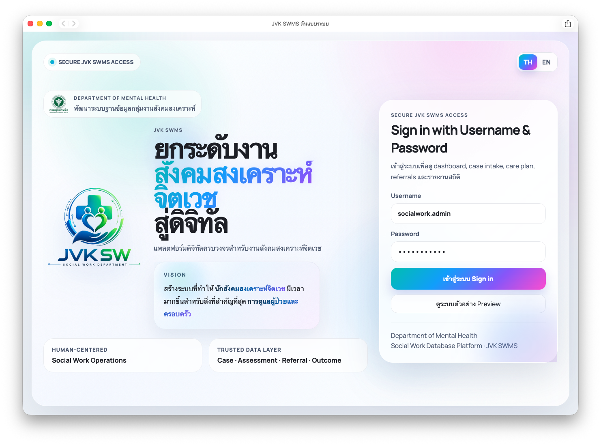
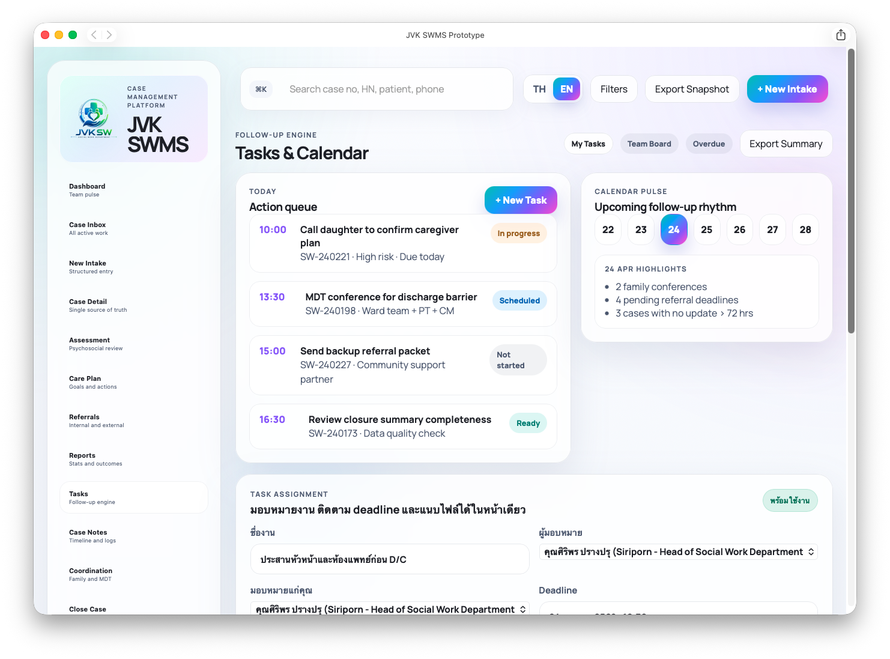

# Digital Social Work Platform for Mental Health Services

## Overview
A digital platform designed to support psychiatric social work services, case documentation, KPI reporting, and real-time monitoring.

## Problem
Paper-based workflow caused delays in case tracking, reporting, and document retrieval.

## Solution
Online intake, e-document, case management dashboard, KPI auto-report, and Telegram notification.

## Tools
Google Sheets, Google Apps Script, Google Forms, Dashboard, Automation

## Impact
- Reduced paper use by approximately 31%
- Improved data accessibility
- Supported real-time service monitoring
- Prepared data for future readmission and SDoH research

## Web Application

## Workflow

